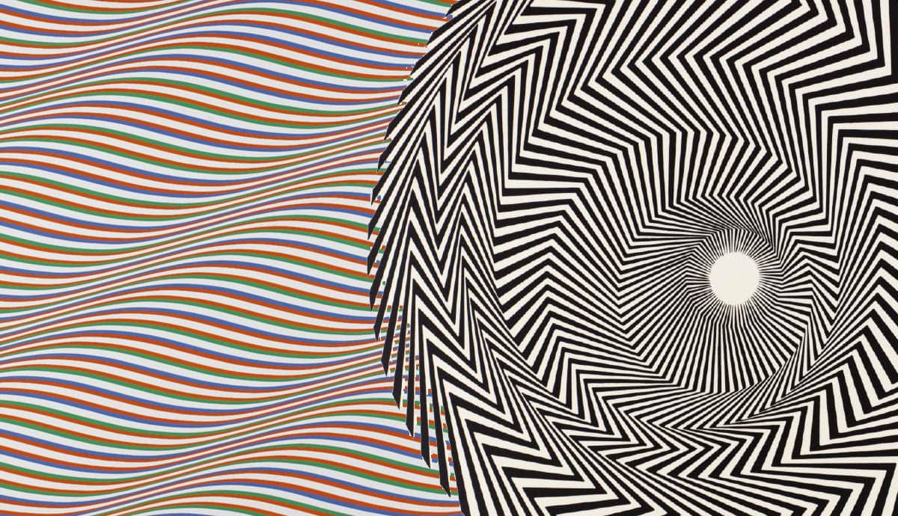
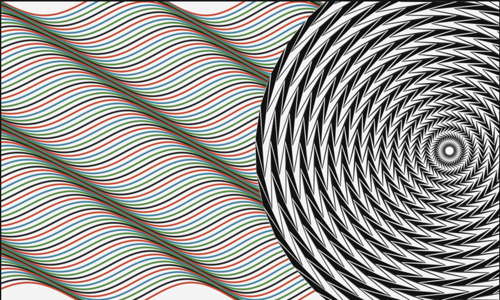

# Op Art Geometric Rendering

This project is an HTML5 Canvas implementation of a Bridget Riley-inspired optical illusion. It features complex, mathematically-driven geometric rendering to create mesmerizing, alternating checkerboard and wavy background patterns.

## Reference Artwork
The visual implementation is closely modeled after the following iconic Op Art style:

## Canvas Result
Below is the output generated by the mathematical logic in the Canvas API:

## Features
- **Phase-Shifted Waves:** A highly accurate sine-wave background utilizing linear phase-shifting to generate sweeping diagonal column alignments.
- **Concentric Checkerboard Vortex:** A 32-layer concentric ring structure that mathematically guarantees sharp, razor-edge alternating chevrons and perfectly opposing optical swirling effects, completely independent of global twisting logic.
- **Zero Dependencies:** Written entirely in Vanilla HTML5, CSS3, and JavaScript Canvas API.

## File Structure
- `index.html`: The structural entry point.
- `css/style.css`: Layout and presentation logic.
- `js/script.js`: The mathematical algorithms mapping out the Canvas API drawings.
- `assets/`: Contains reference material and static files.

## Running Locally
Simply open `index.html` in any modern web browser to view the optical illusion! No build steps or local servers are required.
